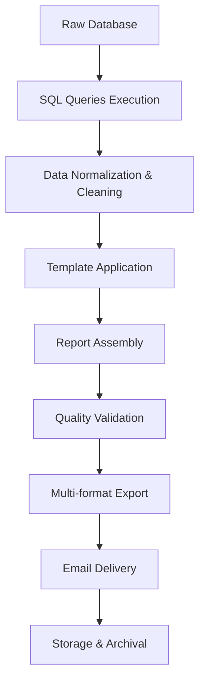
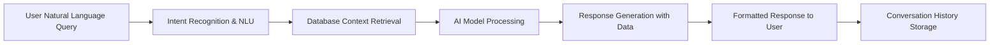
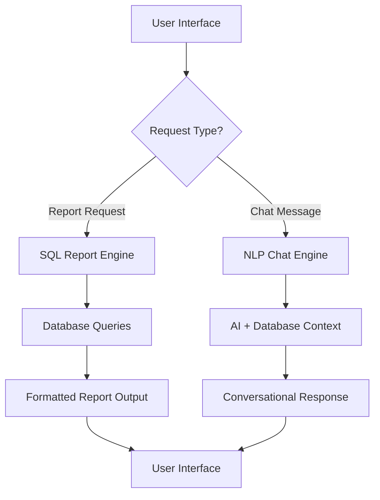
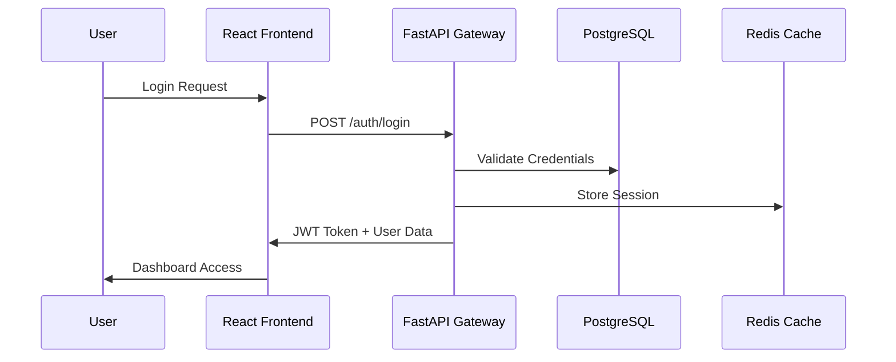
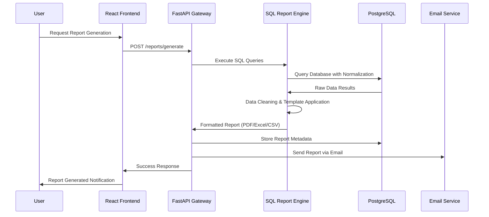
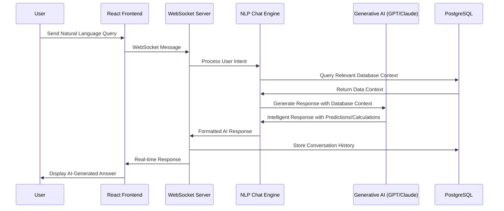

# 🏗️ Synapse System Architecture

## 📊 Logical System Architecture Diagram

image here

## 🔍 Architecture Overview

The Synapse platform implements a **modern layered architecture** designed for enterprise-scale intelligent reporting and natural language processing. The system follows **Domain-Driven Design (DDD)** principles with clear separation of concerns across four primary layers: **Presentation**, **Application Services**, **Business Logic**, and **Data Persistence**. This architecture enables the platform to deliver automated, template-based reporting with AI-powered conversational interfaces while maintaining high scalability, security, and maintainability.

### 🎯 **Architectural Principles**

- **Separation of Concerns**: Each layer has distinct responsibilities
- **Scalability**: Horizontal scaling through containerization and microservices
- **Security-First**: Multi-layered security with JWT, RBAC, and secure communications
- **Observability**: Comprehensive monitoring with Prometheus, Grafana, and Loki
- **Cloud-Native**: Designed for AWS infrastructure with containerized deployments

## **1. 👥 Client Layer (User Personas)**

The client layer defines the system's user personas and their interaction patterns with the platform.

### **👨‍💼 Admin User**

- **Role**: System Administrator & Report Manager
- **Privileges**: Full system access with administrative capabilities
- **Responsibilities**:
  - User lifecycle management (create, activate, deactivate users)
  - Report distribution configuration and recipient management
  - System monitoring and performance analytics
  - Security audit and compliance oversight
  - Template configuration and business rules management

### **👤 Common User**

- **Role**: End User & Report Consumer
- **Privileges**: Limited access to personal features and assigned reports
- **Responsibilities**:
  - Personal profile and credential management
  - Report consumption and historical data access
  - Interactive chat with AI-powered assistant
  - Feedback and system usage analytics contribution

### **🔐 Access Control Matrix**

| Feature              | Admin User           | Common User                |
| -------------------- | -------------------- | -------------------------- |
| User Management      | ✅ Full CRUD         | ❌ Read-only (own profile) |
| Report Configuration | ✅ Full Control      | ❌ View assigned reports   |
| System Analytics     | ✅ Full Access       | ❌ Personal metrics only   |
| AI Chat Interface    | ✅ Advanced Features | ✅ Standard Features       |
| Security Settings    | ✅ Global Settings   | ✅ Personal Settings       |

---

## **2. 🎨 Presentation Layer (UI)**

The **User Interface Layer** is built using modern web technologies with a focus on responsive design, accessibility, and user experience optimization.

### **🛠️ Technology Stack**

- **Frontend Framework**: React 18+ with TypeScript for type safety
- **Styling**: SCSS + Bootstrap for responsive design and component styling
- **UI Components**: PrimeReact for enterprise-grade components
- **Build Tool**: Vite for fast development and optimized production builds
- **State Management**: React Context API with custom hooks
- **Real-time Communication**: WebSocket integration for live features

### **🏗️ Component Architecture**

#### **Authentication Components**

- **Login Module**:
  - Multi-factor authentication support
  - JWT token handling with secure storage
  - Session management and automatic token refresh
  - Remember me functionality with secure cookies (`HttpOnly`, `Secure`, `SameSite`)
- **Registration Module**:
  - Progressive form validation with real-time feedback
  - Email verification workflow
  - Password strength validation
  - Terms of service and privacy policy integration

#### **Core Application Components**

- **Dashboard (Home Screen)**:
  - Personalized widgets based on user role
  - Quick access navigation to key features
  - System notifications and announcements
  - Performance metrics and usage analytics
- **Admin Panel** _(Admin Only)_:

  - User management interface with advanced filtering
  - Role-based access control configuration
  - System health monitoring dashboard
  - Report distribution management
  - Audit log viewer with search capabilities

- **Report Management Interface**:
  - Interactive report gallery with filtering and search
  - Report preview with export capabilities (PDF, Excel, CSV)
  - Historical report timeline and versioning
  - Subscription management for automated reports
- **Profile Management**:

  - Comprehensive profile editing with validation
  - Security settings (password change, 2FA setup)
  - Notification preferences configuration
  - Data export and account deletion options

- **AI Chat Interface**:
  - Real-time messaging with typing indicators
  - Rich text support with code highlighting
  - Conversation history with search functionality
  - File upload and sharing capabilities
  - Voice-to-text integration (future enhancement)

### **🔧 Technical Features**

#### **Performance Optimizations**

- **Code Splitting**: Lazy loading for optimal bundle sizes
- **Caching Strategy**: Service worker for offline capability
- **Image Optimization**: WebP format with fallbacks
- **Progressive Web App**: PWA features for mobile experience

#### **Accessibility & UX**

- **WCAG 2.1 AA Compliance**: Full accessibility support
- **Responsive Design**: Mobile-first approach with breakpoint optimization
- **Dark/Light Mode**: Theme switching with user preference persistence
- **Internationalization**: i18n support for multiple languages (future)

---

## **3. 🔗 Application Services Layer (API Gateway)**

The **Application Services Layer** acts as the orchestration hub, implementing business logic coordination, security enforcement, and external service integration. Built with **FastAPI** and following **Clean Architecture** principles.

### **🏗️ Service Architecture**

#### **🔐 Security & Middleware Stack**

- **JWT Authentication Middleware**:
  - Token validation and refresh logic
  - Role-based access control (RBAC) enforcement
  - Rate limiting and request throttling
  - CORS handling for cross-origin requests
- **Request Processing Pipeline**:
  ```python
  Request → CORS → Rate Limiting → JWT Validation → RBAC → Business Logic → Response
  ```

#### **📡 Core Service Modules**

##### **Authentication Service (`auth.py`)**

- **Endpoints**:
  - `POST /auth/login` - User authentication with MFA support
  - `POST /auth/register` - User registration with email verification
  - `POST /auth/refresh` - JWT token refresh mechanism
  - `POST /auth/logout` - Secure session termination
  - `POST /auth/forgot-password` - Password recovery workflow
- **Features**:
  - Secure password hashing with bcrypt
  - Account lockout protection after failed attempts
  - Session management with Redis caching
  - Integration with external OAuth providers (future)

##### **User Management Service (`user.py`)**

- **Endpoints**:
  - `GET /users` - User listing with pagination and filtering
  - `GET /users/{id}` - Individual user profile retrieval
  - `PUT /users/{id}` - Profile updates with validation
  - `DELETE /users/{id}` - Account deactivation/deletion (GDPR compliant)
  - `POST /users/{id}/roles` - Role assignment (admin only)
- **Features**:
  - Comprehensive user lifecycle management
  - Audit logging for all user operations
  - Data export functionality for compliance
  - Soft delete with recovery capabilities

##### **Real-time Chat Service (`chat.py`)**

- **WebSocket Endpoints**:
  - `WS /chat/connect` - WebSocket connection establishment
  - `WS /chat/message` - Real-time message handling
- **REST Endpoints**:
  - `GET /chat/history` - Conversation history retrieval
  - `POST /chat/conversations` - New conversation creation
  - `DELETE /chat/conversations/{id}` - Conversation deletion
- **Features**:
  - WebSocket connection management with heartbeat
  - Message persistence and retrieval
  - Typing indicators and read receipts
  - File sharing capabilities

##### **Report Management Service (`reports.py`)**

- **Endpoints**:
  - `GET /reports` - Report listing with advanced filtering
  - `GET /reports/{id}` - Individual report retrieval
  - `POST /reports/generate` - On-demand report generation
  - `PUT /reports/{id}/schedule` - Report scheduling configuration
  - `GET /reports/templates` - Available template management
- **Features**:
  - Asynchronous report generation with job queuing
  - Multiple export formats (PDF, Excel, CSV, JSON)
  - Report versioning and change tracking
  - Automated delivery scheduling

##### **Communication Service (`email_sender.py`)**

- **Internal Service Functions**:
  - Template-based email composition
  - Multi-format email support (HTML/Plain text)
  - Attachment handling and security scanning
  - Delivery status tracking and retry logic
- **Integration Points**:
  - SMTP server configuration with failover
  - Email template management system
  - Bounce and complaint handling
  - Analytics and delivery reporting

### **🔄 Service Integration Patterns**

#### **Database Integration**

- **Connection Management**: SQLAlchemy with connection pooling
- **Transaction Handling**: ACID compliance with rollback capabilities
- **Migration Management**: Alembic for schema versioning
- **Performance Optimization**: Query optimization and indexing strategies

#### **External Service Integration**

- **NLP Service Communication**: Async HTTP clients for AI processing
- **Email Service**: SMTP/API integration with major providers
- **Monitoring**: Prometheus metrics export for observability
- **Caching**: Redis integration for performance optimization

### **📊 API Design Standards**

#### **RESTful API Principles**

- **HTTP Methods**: Proper verb usage (GET, POST, PUT, DELETE, PATCH)
- **Status Codes**: Comprehensive HTTP status code implementation
- **Request/Response**: JSON-first with OpenAPI 3.0 specification
- **Versioning**: API versioning strategy for backward compatibility

#### **Documentation & Testing**

- **Auto-generated Docs**: Swagger/OpenAPI integration at `/docs`
- **Interactive Testing**: Built-in API testing interface
- **Schema Validation**: Pydantic models for request/response validation
- **Error Handling**: Standardized error response format

---

## **4. 🧠 Business Intelligence & NLP Layer**

The **Business Intelligence and Natural Language Processing Layer** consists of two distinct processing engines: **Report Generation Engine** for automated SQL-based reporting and **NLP Chat Engine** for intelligent conversational interactions with the database.

### **🏗️ Dual Processing Architecture**

#### **📊 Report Generation Engine (SQL-Based Analytics)**

The report generation system operates independently from NLP, using traditional SQL-based data processing for structured reporting.

##### **Data Processing Pipeline**

```sql
Raw Data Sources → SQL Queries → Data Normalization → Template Application → Report Generation
```

- **SQL Query Engine**:

  - Pre-defined SQL queries for business metrics
  - Complex joins and aggregations for comprehensive reporting
  - Optimized queries with proper indexing strategies
  - Scheduled query execution for automated reports

- **Data Normalization & Cleaning**:

  - Automated data cleansing routines
  - Standardization of data formats and structures
  - Handling of missing values and outliers
  - Data quality validation and error reporting

- **Template-Based Report Generation**:
  - Configurable report templates with business logic
  - Multi-format output (PDF, Excel, HTML, CSV)
  - Automated visualization generation (charts, graphs, tables)
  - Scheduled delivery via email with customizable recipients

##### **Business Intelligence Features**

- **Historical Analysis**: Trend analysis and period comparisons
- **KPI Calculation**: Automated business metric computation
- **Data Aggregation**: Multi-dimensional data summarization
- **Export Capabilities**: Multiple format support for data export

#### **🤖 NLP Chat Engine (AI-Powered Conversational Interface)**

The NLP system operates specifically within the chat interface, providing intelligent responses about the database through generative AI.

##### **Conversational AI Pipeline**

```python
User Query → Intent Recognition → Database Context → AI Response Generation → User Interaction
```

- **Natural Language Understanding (NLU)**:

  - User intent recognition and classification
  - Entity extraction from natural language queries
  - Context understanding for multi-turn conversations
  - Query disambiguation and clarification requests

- **Database Intelligence**:

  - **Real-time Data Access**: Direct database queries based on user questions
  - **Predictive Analytics**: AI-powered forecasting and trend predictions
  - **Calculations**: Dynamic mathematical computations on live data
  - **Data Exploration**: Interactive data discovery through conversation

- **Generative AI Integration**:
  - **Large Language Models**: GPT/Claude integration for intelligent responses
  - **Context Awareness**: Maintains conversation history and database context
  - **Precise Responses**: Accurate and relevant answers about database content
  - **Multi-modal Output**: Text, charts, and data tables in responses

##### **Advanced Chat Capabilities**

- **Predictive Modeling**: Ask for forecasts and trend predictions
- **Complex Calculations**: Perform mathematical operations on database data
- **Data Insights**: Generate insights and recommendations based on data patterns
- **Interactive Queries**: Drill down into data through conversational interface

### **🔧 Technical Implementation**

#### **Processing Infrastructure**

- **Async Task Processing**: Celery with Redis for job queue management
- **Horizontal Scaling**: Microservices architecture for independent scaling
- **Resource Management**: Docker containerization with resource limits
- **Load Balancing**: Intelligent workload distribution across processing nodes

#### **Performance Optimization**

- **Caching Strategy**:
  - **Data Caching**: Frequently accessed datasets in Redis
  - **Model Caching**: Pre-loaded ML models for faster inference
  - **Query Optimization**: Materialized views for complex analytical queries
- **Parallel Processing**:
  - **Multi-threading**: Concurrent data processing workflows
  - **Distributed Computing**: Apache Spark integration for big data processing
  - **GPU Acceleration**: CUDA support for ML model inference

#### **Data Security & Compliance**

- **Data Encryption**: End-to-end encryption for sensitive data processing
- **Privacy Protection**: PII detection and anonymization
- **Compliance Standards**: GDPR, HIPAA, SOX compliance frameworks
- **Audit Trails**: Comprehensive logging of all data operations

### **🔄 Processing Workflow Orchestration**

#### **SQL-Based Report Generation Workflow**



#### **AI-Powered Chat Processing Workflow**



#### **System Integration Flow**



### **🎯 Distinct System Capabilities**

#### **📈 SQL Report Engine Capabilities**

- **Automated Reporting**: Scheduled generation of business reports
- **Data Aggregation**: Complex SQL-based data summarization
- **Historical Analysis**: Time-series analysis and trend identification
- **Multi-format Output**: PDF, Excel, CSV, HTML report generation
- **Template Management**: Configurable report templates for different business needs
- **Performance Optimization**: Optimized SQL queries with proper indexing

#### **🤖 AI Chat Engine Capabilities**

- **Conversational Database Access**: Natural language queries about database content
- **Real-time Predictions**: AI-powered forecasting based on current data
- **Dynamic Calculations**: On-demand mathematical computations using live data
- **Interactive Data Exploration**: Drill-down analysis through conversation
- **Context-Aware Responses**: Maintains conversation history and database context
- **Intelligent Insights**: AI-generated explanations and recommendations
- **Multi-turn Conversations**: Complex, contextual dialogue about data patterns

#### **🔄 System Separation Benefits**

- **Performance Optimization**: Reports don't impact chat performance and vice versa
- **Specialized Processing**: Each engine optimized for its specific use case
- **Scalability**: Independent scaling of reporting and conversational features
- **Maintenance**: Separate codebases allow focused improvements and updates

---

## **5. 🗄️ Data Persistence Layer**

The **Data Persistence Layer** implements a robust, scalable database architecture designed for high-performance analytics and secure data management.

### **🏗️ Database Architecture**

#### **Primary Database - PostgreSQL**

- **Configuration**: Multi-master setup with read replicas for load distribution
- **Performance Features**:
  - Advanced indexing strategies (B-tree, GIN, GIST)
  - Partitioning for large analytical tables
  - Connection pooling with PgBouncer
  - Query optimization with EXPLAIN analysis

#### **Data Security & Compliance**

- **Encryption at Rest**: AES-256 encryption for sensitive data
- **Column-Level Security**: Sensitive field encryption (PII, credentials)
- **Row-Level Security**: Multi-tenant data isolation
- **Backup Strategy**: Automated daily backups with point-in-time recovery
- **GDPR Compliance**: Data anonymization and right-to-be-forgotten implementation

### **🚀 Caching & Performance Layer**

#### **Redis Configuration**

- **Session Storage**: User sessions and JWT blacklists
- **Application Cache**: Frequently accessed data caching
- **Rate Limiting**: API rate limiting counters
- **Real-time Features**: WebSocket connection management

#### **Performance Optimization**

- **Query Optimization**: Materialized views for complex analytics
- **Connection Management**: Connection pooling and timeout management
- **Indexing Strategy**: Composite indexes for multi-column queries
- **Archive Strategy**: Historical data archiving for performance

---

## **6. 🔒 Security Architecture**

### **🛡️ Multi-Layered Security Framework**

#### **Authentication & Authorization**

- **JWT Implementation**:

  - Secure token generation with RS256 algorithm
  - Token rotation and refresh mechanism
  - Secure cookie storage (`HttpOnly`, `Secure`, `SameSite=Strict`)
  - Automatic token expiration and cleanup

- **Role-Based Access Control (RBAC)**:
  - Granular permissions system
  - Dynamic role assignment
  - Resource-level access control
  - Admin privilege escalation protection

#### **Network Security**

- **HTTPS Enforcement**: TLS 1.3 with perfect forward secrecy
- **CORS Configuration**: Strict cross-origin resource sharing policies
- **Rate Limiting**: DDoS protection with intelligent throttling
- **Input Validation**: Comprehensive sanitization against injection attacks

#### **Data Protection**

- **Encryption Standards**:
  - Data at rest: AES-256 encryption
  - Data in transit: TLS 1.3 encryption
  - Database encryption: Transparent data encryption (TDE)
- **Privacy Controls**:
  - PII detection and masking
  - GDPR compliance tools
  - Data retention policies
  - Secure data deletion

#### **Monitoring & Incident Response**

- **Security Monitoring**: Real-time threat detection
- **Audit Logging**: Comprehensive security event logging
- **Intrusion Detection**: Automated anomaly detection
- **Incident Response**: Automated security incident workflows

---

## **7. 📊 Monitoring & Observability**

### **🔍 Comprehensive Monitoring Stack**

#### **Metrics Collection - Prometheus**

- **Application Metrics**: Response times, throughput, error rates
- **Business Metrics**: User engagement, report generation success rates
- **Infrastructure Metrics**: CPU, memory, disk, network utilization
- **Custom Metrics**: Domain-specific KPIs and performance indicators

#### **Visualization - Grafana**

- **Real-time Dashboards**: Live system health monitoring
- **Business Intelligence**: Executive dashboards with key metrics
- **Alert Management**: Intelligent alerting with escalation policies
- **Historical Analysis**: Trend analysis and capacity planning

#### **Log Management - Loki**

- **Centralized Logging**: Structured log aggregation across all services
- **Log Analysis**: Advanced querying and correlation capabilities
- **Error Tracking**: Automated error detection and classification
- **Compliance Logging**: Audit trail maintenance for regulatory requirements

---

## **8. 🛠️ Complete Technology Stack**

### **Frontend Technologies**

| Component      | Technology                   | Purpose                               |
| -------------- | ---------------------------- | ------------------------------------- |
| **Framework**  | React 18+                    | Component-based UI development        |
| **Language**   | TypeScript                   | Type-safe JavaScript development      |
| **Styling**    | SCSS + Bootstrap             | Responsive and maintainable styling   |
| **UI Library** | PrimeReact                   | Enterprise-grade components           |
| **Build Tool** | Vite                         | Fast development and optimized builds |
| **Testing**    | Jest + React Testing Library | Comprehensive frontend testing        |

### **Backend Technologies**

| Component          | Technology     | Purpose                            |
| ------------------ | -------------- | ---------------------------------- |
| **Framework**      | FastAPI        | High-performance API development   |
| **Language**       | Python 3.11+   | Backend development and AI/ML      |
| **Database**       | PostgreSQL 15+ | Primary data storage               |
| **Caching**        | Redis 7+       | Performance and session management |
| **Task Queue**     | Celery + Redis | Asynchronous job processing        |
| **Authentication** | JWT + bcrypt   | Secure authentication system       |

### **Infrastructure & DevOps**

| Component            | Technology                  | Purpose                           |
| -------------------- | --------------------------- | --------------------------------- |
| **Containerization** | Docker + Docker Compose     | Application containerization      |
| **Orchestration**    | Kubernetes (future)         | Container orchestration           |
| **Monitoring**       | Prometheus + Grafana + Loki | Complete observability stack      |
| **CI/CD**            | GitHub Actions              | Automated testing and deployment  |
| **Code Quality**     | Husky + ESLint + Black      | Code quality enforcement          |
| **Cloud Platform**   | AWS                         | Cloud infrastructure and services |

---

## **9. 🔄 System Data Flows**

### **🚀 Primary User Workflows**

#### **Authentication Flow**



#### **SQL-Based Report Generation Flow**



#### **AI-Powered Chat Flow**



---

## **10. 🎯 Architecture Benefits & Advantages**

### **🔧 Technical Benefits**

- **Scalability**: Microservices architecture enables independent scaling of components
- **Maintainability**: Clear separation of concerns makes code easier to maintain and extend
- **Performance**: Optimized database queries, caching, and asynchronous processing
- **Security**: Multi-layered security approach with industry best practices
- **Observability**: Comprehensive monitoring provides deep insights into system behavior

### **💼 Business Benefits**

- **Time-to-Market**: Rapid feature development and deployment capabilities
- **Cost Efficiency**: Cloud-native architecture optimizes infrastructure costs
- **Compliance**: Built-in GDPR and audit compliance features
- **User Experience**: Responsive, accessible, and intuitive interface design
- **Intelligence**: AI-powered insights provide competitive business advantages

### **🔮 Future-Ready Architecture**

- **Extensibility**: Plugin architecture for easy feature extensions
- **Integration**: RESTful APIs enable seamless third-party integrations
- **Cloud Agnostic**: Architecture can be deployed across multiple cloud providers
- **AI Evolution**: Modular NLP layer supports emerging AI technologies

---

## **📈 Performance & Scalability Metrics**

### **🎯 Performance Targets**

- **API Response Time**: < 200ms for standard operations
- **Report Generation**: < 30 seconds for complex reports
- **Concurrent Users**: Support for 10,000+ simultaneous users
- **Database Queries**: < 100ms for 95th percentile queries
- **System Uptime**: 99.9% availability SLA

### **📊 Scalability Characteristics**

- **Horizontal Scaling**: Auto-scaling based on load metrics
- **Database Scaling**: Read replicas and connection pooling
- **Cache Optimization**: Intelligent caching reduces database load
- **Load Distribution**: Geographic load balancing for global users

---

**📌 Architecture Summary:**
The Synapse platform implements a **modern, scalable, and secure architecture** that combines enterprise-grade infrastructure with cutting-edge AI capabilities. The system provides intelligent reporting automation through a user-friendly interface, backed by robust data processing and comprehensive monitoring systems.
