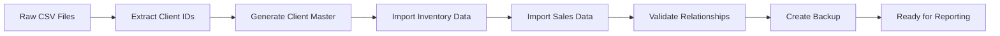
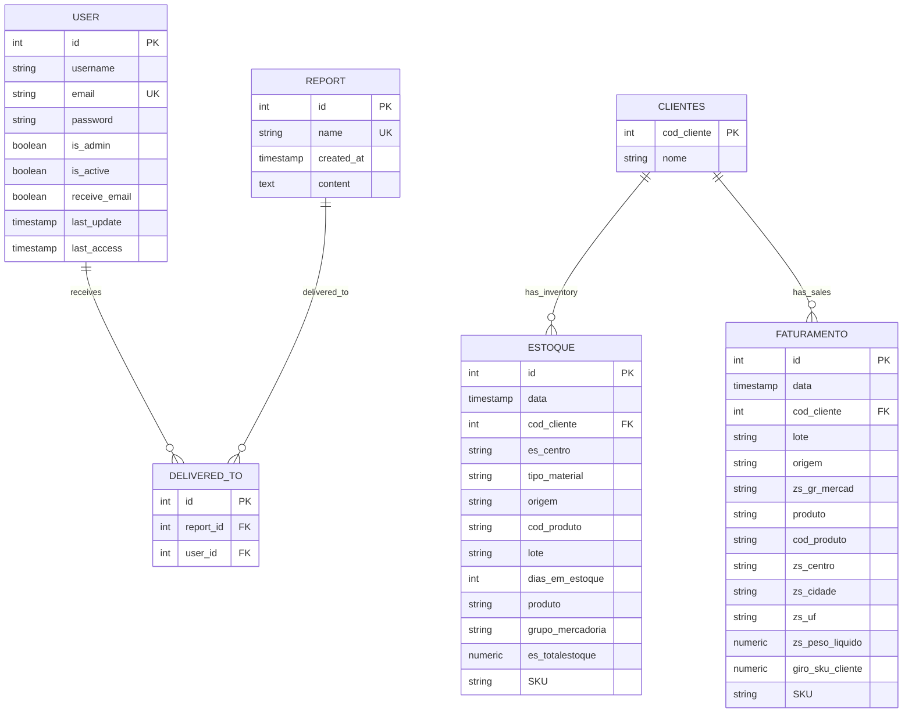

# 🗄️ **Synapse Database Model Documentation**

## 📋 **Overview**

This document provides comprehensive documentation of the Synapse database schema, including table structures, relationships, indexes, and data flow patterns. The database uses PostgreSQL with SQLAlchemy ORM for robust data management and type safety.

### **🔗 Quick Navigation**

| Section                                                        | Description                                    |
| -------------------------------------------------------------- | ---------------------------------------------- |
| [Database Architecture](#️-database-architecture)              | Technology stack and schema overview           |
| [Core Tables](#-core-tables)                                   | User management and report tables              |
| [Business Intelligence Tables](#-business-intelligence-tables) | Client, inventory, and sales data              |
| [Entity Relationships](#-database-relationships)               | ER diagram and relationship descriptions       |
| [ETL Process](#-data-loading--etl-process)                     | Data loading pipeline and business data import |
| [Business Insights](#-business-intelligence-data-insights)     | Data volume, metrics, and industry analysis    |
| [Database Management](#️-database-management)                  | Migration, backup, and monitoring              |

### **📖 Related Documentation**

- **[← Back to Main README](../README.md)** - Project overview and getting started
- **[🔐 RBAC Security](./rbac.md)** - User roles and permissions model
- **[🔌 API Endpoints](./api_endpoints.md)** - REST API documentation with database operations
- **[📁 Database Models (Code)](../backend/src/database/models.py)** - SQLAlchemy model definitions

---

## 🏗️ **Database Architecture**

### **🔧 Technology Stack**

- **Database Engine**: PostgreSQL 15+
- **ORM**: SQLAlchemy 2.0 with async support
- **Migration Tool**: Alembic for version control
- **Connection Pool**: SQLAlchemy connection pooling
- **Caching Layer**: Redis for session and query caching

### **📊 Schema Overview**

The database follows a **normalized relational design** with clear separation of concerns:

- **User Management**: Authentication, profiles, and permissions
- **Content Management**: Reports, templates, and delivery tracking
- **Business Intelligence**: Raw business data (clients, inventory, sales)
- **AI/Chat System**: Conversations and message history (planned)

---

## 📋 **Core Tables**

### **👤 User Management Tables**

#### **`user` Table**

Primary table for user authentication and profile management.

```sql
CREATE TABLE user (
    id SERIAL PRIMARY KEY,
    username VARCHAR NOT NULL,
    email VARCHAR UNIQUE NOT NULL,
    password VARCHAR NOT NULL,          -- Bcrypt hash
    is_admin BOOLEAN DEFAULT FALSE,
    is_active BOOLEAN DEFAULT TRUE,
    receive_email BOOLEAN DEFAULT TRUE,
    last_update TIMESTAMP DEFAULT NOW(),
    last_access TIMESTAMP NULL
);
```

**SQLAlchemy Model:**

```python
class User(Base):
    __tablename__ = "user"

    id: Mapped[int] = mapped_column(Integer, primary_key=True, autoincrement=True)
    username: Mapped[str] = mapped_column(String)
    email: Mapped[str] = mapped_column(String, unique=True)
    password: Mapped[str] = mapped_column(String)  # Bcrypt hash
    is_admin: Mapped[bool] = mapped_column(Boolean, server_default=text("FALSE"))
    is_active: Mapped[bool] = mapped_column(Boolean, server_default=text("TRUE"))
    receive_email: Mapped[bool] = mapped_column(Boolean, server_default=text("TRUE"))
    last_update: Mapped[datetime] = mapped_column(DateTime, server_default=func.now())
    last_access: Mapped[datetime | None] = mapped_column(DateTime, nullable=True)
```

**Key Features:**

- **Unique email constraint** prevents duplicate accounts
- **Password hashing** using bcrypt with automatic salt
- **Role-based access** via `is_admin` flag
- **Account status** management with `is_active`
- **Email preferences** control via `receive_email`
- **Activity tracking** with `last_access` timestamp

---

### **📊 Report Management Tables**

#### **`report` Table**

Stores generated reports with metadata and content.

```sql
CREATE TABLE report (
    id SERIAL PRIMARY KEY,
    name VARCHAR UNIQUE NOT NULL,
    created_at TIMESTAMP DEFAULT NOW(),
    content TEXT NOT NULL
);
```

**SQLAlchemy Model:**

```python
class Report(Base):
    __tablename__ = "report"

    id: Mapped[int] = mapped_column(Integer, primary_key=True, autoincrement=True)
    name: Mapped[str] = mapped_column(String, nullable=False, unique=True)
    created_at: Mapped[datetime] = mapped_column(DateTime, server_default=func.now())
    content: Mapped[str] = mapped_column(String, nullable=False)

    # Relationships
    delivered_to: Mapped[list["DeliveredTo"]] = relationship(
        "DeliveredTo",
        back_populates="report",
        cascade="all, delete-orphan"
    )
```

**Key Features:**

- **Unique report names** prevent duplicates
- **Rich content storage** supports HTML/text formats
- **Automatic timestamping** for audit trail
- **Cascade deletion** maintains referential integrity

---

#### **`delivered_to` Table**

Junction table tracking report deliveries to users.

```sql
CREATE TABLE delivered_to (
    id SERIAL PRIMARY KEY,
    report_id INTEGER REFERENCES report(id) NOT NULL,
    user_id INTEGER REFERENCES user(id) NOT NULL
);
```

**SQLAlchemy Model:**

```python
class DeliveredTo(Base):
    __tablename__ = "delivered_to"

    id: Mapped[int] = mapped_column(Integer, primary_key=True, autoincrement=True)
    report_id: Mapped[int] = mapped_column(Integer, ForeignKey("report.id"), nullable=False)
    user_id: Mapped[int] = mapped_column(Integer, ForeignKey("user.id"), nullable=False)

    # Relationships
    report: Mapped["Report"] = relationship("Report", back_populates="delivered_to")
    user: Mapped["User"] = relationship("User")
```

**Key Features:**

- **Many-to-many relationship** between reports and users
- **Delivery tracking** for audit and debugging
- **Foreign key constraints** ensure data integrity

---

### **🏢 Business Intelligence Tables**

#### **`clientes` Table**

Client/customer master data derived from business transactions.

```sql
CREATE TABLE clientes (
    cod_cliente INTEGER PRIMARY KEY,
    nome VARCHAR(100) NULL
);
```

**SQLAlchemy Model:**

```python
class Clients(Base):
    __tablename__ = "clientes"

    cod_cliente: Mapped[int] = mapped_column(Integer, primary_key=True)
    nome: Mapped[str | None] = mapped_column(String(100))
```

**Data Source & ETL Process:**

- **Source**: Automatically extracted from `estoque 1.csv` and `faturamento 1.csv` files
- **ETL Logic**: Unique client codes are collected from both inventory and sales data
- **Name Generation**: Auto-generated names using pattern `'Cliente ' + ROW_NUMBER()`
- **Primary Key**: Natural business key (`cod_cliente`) from source systems
- **Record Count**: ~500+ unique clients (dynamically determined by source data)

---

#### **`estoque` Table**

Inventory/stock data with detailed tracking for manufacturing/steel industry.

```sql
CREATE TABLE estoque (
    id SERIAL PRIMARY KEY,
    data TIMESTAMP NOT NULL,
    cod_cliente INTEGER REFERENCES clientes(cod_cliente),
    es_centro VARCHAR(50) NOT NULL,
    tipo_material VARCHAR(100) NOT NULL,
    origem VARCHAR(50) NOT NULL,
    cod_produto VARCHAR(50) NOT NULL,
    lote VARCHAR(50) NOT NULL,
    dias_em_estoque INTEGER NOT NULL,
    produto VARCHAR(100) NOT NULL,
    grupo_mercadoria VARCHAR(100) NOT NULL,
    es_totalestoque NUMERIC NOT NULL,
    SKU VARCHAR(50) NOT NULL
);
```

**SQLAlchemy Model:**

```python
class Estoque(Base):
    __tablename__ = "estoque"

    id: Mapped[int] = mapped_column(Integer, primary_key=True, autoincrement=True)
    data: Mapped[datetime] = mapped_column(DateTime)
    cod_cliente: Mapped[int] = mapped_column(ForeignKey("clientes.cod_cliente"))
    es_centro: Mapped[str] = mapped_column(String(50))
    tipo_material: Mapped[str] = mapped_column(String(100))
    origem: Mapped[str] = mapped_column(String(50))
    cod_produto: Mapped[str] = mapped_column(String(50))
    lote: Mapped[str] = mapped_column(String(50))
    dias_em_estoque: Mapped[int] = mapped_column(Integer)
    produto: Mapped[str] = mapped_column(String(100))
    grupo_mercadoria: Mapped[str] = mapped_column(String(100))
    es_totalestoque: Mapped[float] = mapped_column(Numeric)
    SKU: Mapped[str] = mapped_column(String(50))
```

**Field Definitions & Business Logic:**

- **`data`**: Inventory snapshot date (YYYY-MM-DD format)
- **`cod_cliente`**: Client identifier linking to `clientes` table
- **`es_centro`**: Distribution/storage center code (e.g., "32D1", "1101")
- **`tipo_material`**: Material classification ("Materia Prima", "Produto Acabado")
- **`origem`**: Material origin code (e.g., "E_PRG_REF", "S_PRG_REF")
- **`cod_produto`**: Internal product code (e.g., "BFF", "RFF", "RFQD")
- **`lote`**: Production batch identifier for traceability
- **`dias_em_estoque`**: Days in inventory (aging analysis)
- **`produto`**: Product type/form ("Bobina", "Rolo", "Chapa")
- **`grupo_mercadoria`**: Product group ("Laminado a Frio", "Laminado a Quente")
- **`es_totalestoque`**: Total inventory quantity (metric tons)
- **`SKU`**: Stock Keeping Unit for inventory management

**Data Characteristics:**

- **Source File**: `estoque 1.csv` with pipe-delimited format
- **Record Count**: ~1,473 inventory records
- **Date Range**: Recent inventory snapshots (2025 data)
- **Business Domain**: Steel/metallurgical industry inventory management

---

#### **`faturamento` Table**

Sales/billing transaction data with detailed geographic and product information.

```sql
CREATE TABLE faturamento (
    id SERIAL PRIMARY KEY,
    data TIMESTAMP NOT NULL,
    cod_cliente INTEGER REFERENCES clientes(cod_cliente),
    lote VARCHAR(50) NOT NULL,
    origem VARCHAR(50) NOT NULL,
    zs_gr_mercad VARCHAR(100) NOT NULL,
    produto VARCHAR(100) NOT NULL,
    cod_produto VARCHAR(50) NOT NULL,
    zs_centro VARCHAR(50) NOT NULL,
    zs_cidade VARCHAR(100) NOT NULL,
    zs_uf VARCHAR(10) NOT NULL,
    zs_peso_liquido NUMERIC NOT NULL,
    giro_sku_cliente NUMERIC NOT NULL,
    SKU VARCHAR(50) NOT NULL
);
```

**SQLAlchemy Model:**

```python
class Faturamento(Base):
    __tablename__ = "faturamento"

    id: Mapped[int] = mapped_column(Integer, primary_key=True, autoincrement=True)
    data: Mapped[datetime] = mapped_column(DateTime)
    cod_cliente: Mapped[int] = mapped_column(ForeignKey("clientes.cod_cliente"))
    lote: Mapped[str] = mapped_column(String(50))
    origem: Mapped[str] = mapped_column(String(50))
    zs_gr_mercad: Mapped[str] = mapped_column(String(100))
    produto: Mapped[str] = mapped_column(String(100))
    cod_produto: Mapped[str] = mapped_column(String(50))
    zs_centro: Mapped[str] = mapped_column(String(50))
    zs_cidade: Mapped[str] = mapped_column(String(100))
    zs_uf: Mapped[str] = mapped_column(String(10))
    zs_peso_liquido: Mapped[float] = mapped_column(Numeric)
    giro_sku_cliente: Mapped[float] = mapped_column(Numeric)
    SKU: Mapped[str] = mapped_column(String(50))
```

**Field Definitions & Business Logic:**

- **`data`**: Transaction/billing date (historical sales data)
- **`cod_cliente`**: Customer identifier linking to `clientes` table
- **`lote`**: Production batch for quality/traceability tracking
- **`origem`**: Product origin/source code ("PRG" - likely "Produzido")
- **`zs_gr_mercad`**: Product group classification ("ZINCADO", "LAMINADO A QUENTE")
- **`produto`**: Product type/form ("Chapa" - steel sheets/plates)
- **`cod_produto`**: Product code (e.g., "CZN" - galvanized, "CG" - hot rolled)
- **`zs_centro`**: Distribution center code ("22D1", "1101")
- **`zs_cidade`**: Delivery city ("CURITIBA", "POMPEIA", etc.)
- **`zs_uf`**: Brazilian state code ("PR", "SP", etc.)
- **`zs_peso_liquido`**: Net weight in metric tons (actual shipped quantity)
- **`giro_sku_cliente`**: SKU turnover rate per client (business KPI)
- **`SKU`**: Stock Keeping Unit for sales tracking

**Data Characteristics:**

- **Source File**: `faturamento 1.csv` with pipe-delimited format
- **Record Count**: ~17,345 billing transactions
- **Date Range**: Historical sales data (2024-2025)
- **Geographic Coverage**: Multiple Brazilian states (PR, SP, etc.)
- **Business Domain**: Steel/metallurgical industry sales transactions

---

### **🧪 Development Tables**

#### **`example` Table**

Template/example table for development reference.

```python
class Example(Base):
    __tablename__ = "example"

    id: Mapped[int] = mapped_column(Integer, primary_key=True, autoincrement=True)
    name: Mapped[str] = mapped_column(String, unique=True)
    enabled: Mapped[bool] = mapped_column(Boolean, server_default=text("TRUE"))
    created_at: Mapped[datetime] = mapped_column(DateTime, server_default=func.now())
    updated_at: Mapped[datetime] = mapped_column(DateTime, server_onupdate=func.now())
```

#### **`test` Table**

Testing and development utilities.

```python
class Test(Base):
    __tablename__ = "test"

    id: Mapped[int] = mapped_column(Integer, primary_key=True, autoincrement=True)
    name: Mapped[str] = mapped_column(String)
```

---

## � **Data Loading & ETL Process**

### **📥 Business Data Import**

The system includes an automated ETL (Extract, Transform, Load) process for business intelligence data through the `load_synapse_data.sh` script.

#### **ETL Workflow**

```bash
#!/bin/bash
# Synapse Data Loading Pipeline
DB_NAME="synapse"
ESTOQUE_FILE="./estoque 1.csv"      # ~1,473 inventory records
FATURAMENTO_FILE="./faturamento 1.csv"  # ~17,345 sales records
```

#### **Data Processing Steps**

1. **Client Master Data Generation**

   ```bash
   # Extract unique client codes from both files
   { cut -d"|" -f2 "$ESTOQUE_FILE" | tail -n +2;
     cut -d"|" -f2 "$FATURAMENTO_FILE" | tail -n +2; } \
     | sort -u >> "$CLIENTES_FILE"
   ```

2. **Client Names Auto-Generation**

   ```sql
   UPDATE clientes c SET nome = 'Cliente ' || ROW_NUMBER()
   FROM (SELECT cod_cliente FROM clientes ORDER BY cod_cliente) cte
   WHERE c.cod_cliente = cte.cod_cliente;
   ```

3. **Inventory Data Import**

   ```bash
   \COPY estoque(data, cod_cliente, es_centro, tipo_material, origem,
                 cod_produto, lote, dias_em_estoque, produto, grupo_mercadoria,
                 es_totalestoque, "SKU")
   FROM 'estoque 1.csv' WITH (FORMAT csv, HEADER true, DELIMITER '|')
   ```

4. **Sales Data Import**

   ```bash
   \COPY faturamento(data, cod_cliente, lote, origem, zs_gr_mercad, produto,
                     cod_produto, zs_centro, zs_cidade, zs_uf, zs_peso_liquido,
                     giro_sku_cliente, "SKU")
   FROM 'faturamento 1.csv' WITH (FORMAT csv, HEADER true, DELIMITER '|')
   ```

5. **Database Backup Generation**
   ```bash
   pg_dump -U postgres -d "$DB_NAME" > "${DB_NAME}_backup.dump"
   ```

#### **Data Validation & Quality Checks**

- **Referential Integrity**: Foreign key constraints ensure all transactions link to valid clients
- **Format Validation**: CSV import validates data types and constraints
- **Duplicate Prevention**: Primary keys and unique constraints prevent data duplication
- **Error Handling**: Script uses `set -e` to stop on any error

#### **File Specifications**

| File                     | Format | Delimiter | Records | Primary Use |
| ------------------------ | ------ | --------- | ------- | ----------- | --------------------------------- |
| `estoque 1.csv`          | CSV    | Pipe (`   | `)      | ~1,473      | Inventory analysis, stock reports |
| `faturamento 1.csv`      | CSV    | Pipe (`   | `)      | ~17,345     | Sales analysis, revenue reports   |
| Generated `clientes.csv` | CSV    | Pipe (`   | `)      | ~500+       | Customer master data              |

#### **Business Data Pipeline**



---

## �🔗 **Database Relationships**

### **Entity Relationship Diagram**

<p align="center">

</p>

#### **Detailed Entity Relationship Structure**



### **Relationship Descriptions**

1. **User ↔ Report (Many-to-Many)**

   - Users can receive multiple reports
   - Reports can be delivered to multiple users
   - Junction table: `delivered_to`

2. **Client ↔ Inventory (One-to-Many)**

   - Each client can have multiple inventory records
   - Foreign key: `estoque.cod_cliente → clientes.cod_cliente`

3. **Client ↔ Sales (One-to-Many)**
   - Each client can have multiple sales transactions
   - Foreign key: `faturamento.cod_cliente → clientes.cod_cliente`

---

## 📊 **Business Intelligence Data Insights**

### **📈 Data Volume & Characteristics**

| Table         | Record Count | Date Range           | Business Purpose              |
| ------------- | ------------ | -------------------- | ----------------------------- |
| `clientes`    | ~500+ unique | N/A (derived)        | Customer master data          |
| `estoque`     | ~1,473       | 2025-08-04           | Current inventory levels      |
| `faturamento` | ~17,345      | 2024-01-10 to recent | Historical sales transactions |

### **🏭 Industry Domain Analysis**

**Steel/Metallurgical Industry Focus:**

- **Product Types**: Bobinas (coils), Rolos (rolls), Chapas (sheets/plates)
- **Material Classifications**: Laminado a Frio (cold rolled), Laminado a Quente (hot rolled), Zincado (galvanized)
- **Geographic Distribution**: Brazil-wide with focus on PR (Paraná) and SP (São Paulo) states
- **Inventory Management**: Batch tracking, aging analysis, SKU-based management

### **📊 Key Business Metrics Available**

1. **Inventory Metrics**

   - Stock aging (days in inventory)
   - Inventory levels by client/product
   - Material type distribution
   - Storage center utilization

2. **Sales Performance**

   - Revenue by client/region
   - Product mix analysis
   - SKU turnover rates
   - Geographic sales distribution

3. **Operational KPIs**
   - Client concentration analysis
   - Inventory turnover by SKU
   - Regional performance comparison
   - Product line profitability

### **🎯 Report Generation Opportunities**

**Automated Reports Supported:**

- Monthly inventory aging reports
- Client sales performance dashboards
- Regional sales analysis
- Product mix and profitability reports
- SKU turnover and demand forecasting
- Inventory optimization recommendations

---

## 📊 **Database Indexes**

### **Primary Keys**

All tables have auto-incrementing integer primary keys for optimal performance.

### **Unique Constraints**

- `user.email`: Prevents duplicate user accounts
- `report.name`: Ensures unique report identification
- `example.name`: Development table constraint

### **Foreign Key Indexes**

Automatically created for all foreign key relationships:

- `delivered_to.report_id`
- `delivered_to.user_id`
- `estoque.cod_cliente`
- `faturamento.cod_cliente`

### **Recommended Additional Indexes** (Performance Optimization)

```sql
-- User authentication optimization
CREATE INDEX idx_user_email ON user(email);
CREATE INDEX idx_user_active ON user(is_active) WHERE is_active = true;

-- Report querying optimization
CREATE INDEX idx_report_created_at ON report(created_at);
CREATE INDEX idx_delivered_to_user_id ON delivered_to(user_id);

-- Business data analysis optimization
CREATE INDEX idx_estoque_data ON estoque(data);
CREATE INDEX idx_estoque_cliente ON estoque(cod_cliente);
CREATE INDEX idx_faturamento_data ON faturamento(data);
CREATE INDEX idx_faturamento_cliente ON faturamento(cod_cliente);
```

---

## 🔄 **Data Flow Patterns**

### **User Registration Flow**

1. Validate input data (email uniqueness, password strength)
2. Hash password using bcrypt
3. Insert user record with default settings
4. Return success/error response

### **Report Generation Flow**

1. Execute SQL queries on business data tables
2. Process and normalize data
3. Generate report content (HTML/text)
4. Insert report record with metadata
5. Create delivery records in `delivered_to` table
6. Trigger email notifications

### **Authentication Flow**

1. Validate user credentials against `user` table
2. Check `is_active` status
3. Generate JWT tokens with user context
4. Update `last_access` timestamp
5. Set secure HTTPOnly cookies

---

## 🔒 **Security Considerations**

### **Password Security**

- **Bcrypt hashing** with automatic salt generation
- **Minimum 8 characters** policy (to be enhanced)
- **No plaintext storage** - only hashed values

### **Data Protection**

- **Foreign key constraints** prevent orphaned records
- **Cascade deletion** maintains referential integrity
- **Input validation** at application layer
- **SQL injection prevention** via SQLAlchemy ORM

### **Access Control**

- **Row-level security** via application logic
- **Admin-only operations** protected by middleware
- **User isolation** - users can only access their own data

---

## 🛠️ **Database Management**

### **Migration Management with Alembic**

**Generate new migration:**

```bash
cd backend
alembic revision --autogenerate -m "Description of changes"
```

**Apply migrations:**

```bash
alembic upgrade head
```

**Rollback migrations:**

```bash
alembic downgrade -1  # Previous version
alembic downgrade base  # Reset to initial state
```

### **Backup and Restore**

**Backup database:**

```bash
pg_dump -h localhost -U postgres -d synapse > backup.sql
```

**Restore database:**

```bash
psql -h localhost -U postgres -d synapse < backup.sql
```

### **Performance Monitoring**

**Check table sizes:**

```sql
SELECT
    schemaname,
    tablename,
    pg_size_pretty(pg_total_relation_size(schemaname||'.'||tablename)) as size
FROM pg_tables
WHERE schemaname = 'public'
ORDER BY pg_total_relation_size(schemaname||'.'||tablename) DESC;
```

**Monitor query performance:**

```sql
SELECT query, mean_time, calls
FROM pg_stat_statements
ORDER BY mean_time DESC
LIMIT 10;
```

---

## 📈 **Planned Enhancements**

### **Chat/NLP Tables (Sprint 2)**

#### **`conversation` Table**

```python
class Conversation(Base):
    __tablename__ = "conversation"

    id: Mapped[str] = mapped_column(String, primary_key=True)  # UUID
    user_id: Mapped[int] = mapped_column(ForeignKey("user.id"))
    title: Mapped[str] = mapped_column(String(255))
    created_at: Mapped[datetime] = mapped_column(DateTime, server_default=func.now())
    updated_at: Mapped[datetime] = mapped_column(DateTime, server_onupdate=func.now())
    is_active: Mapped[bool] = mapped_column(Boolean, default=True)
```

#### **`message` Table**

```python
class Message(Base):
    __tablename__ = "message"

    id: Mapped[str] = mapped_column(String, primary_key=True)  # UUID
    conversation_id: Mapped[str] = mapped_column(ForeignKey("conversation.id"))
    user_message: Mapped[str] = mapped_column(Text)
    ai_response: Mapped[str] = mapped_column(Text)
    created_at: Mapped[datetime] = mapped_column(DateTime, server_default=func.now())
    processing_time: Mapped[float] = mapped_column(Numeric)  # Response time in seconds
```

### **Audit Log Tables (Sprint 3)**

#### **`audit_log` Table**

```python
class AuditLog(Base):
    __tablename__ = "audit_log"

    id: Mapped[int] = mapped_column(Integer, primary_key=True, autoincrement=True)
    user_id: Mapped[int] = mapped_column(ForeignKey("user.id"))
    action: Mapped[str] = mapped_column(String(50))  # CREATE, UPDATE, DELETE
    table_name: Mapped[str] = mapped_column(String(50))
    record_id: Mapped[str] = mapped_column(String(50))
    old_values: Mapped[dict] = mapped_column(JSON)
    new_values: Mapped[dict] = mapped_column(JSON)
    timestamp: Mapped[datetime] = mapped_column(DateTime, server_default=func.now())
    ip_address: Mapped[str] = mapped_column(String(45))  # IPv6 compatible
```

---

## 📖 **Additional Resources**

- **[RBAC Documentation](./rbac.md)** - Security model and user permissions
- **[API Endpoints](./api_endpoints.md)** - Complete API documentation
- **[SQLAlchemy Documentation](https://docs.sqlalchemy.org/)** - ORM reference
- **[Alembic Documentation](https://alembic.sqlalchemy.org/)** - Migration guide
- **[PostgreSQL Documentation](https://www.postgresql.org/docs/)** - Database reference

---

---

## 🔗 **Navigation**

- **[← Back to Main Documentation](../README.md#datamodel)** - Return to project overview
- **[🔐 Security Model](./rbac.md)** - User authentication and authorization
- **[🔌 API Documentation](./api_endpoints.md)** - REST API endpoints and operations

---

**📝 Last Updated:** 29/09/2025  
**👤 Responsible:** Synapse Development Team  
**🔄 Next Review:** Sprint 3 Start  
**📊 Schema Version:** v1.2
