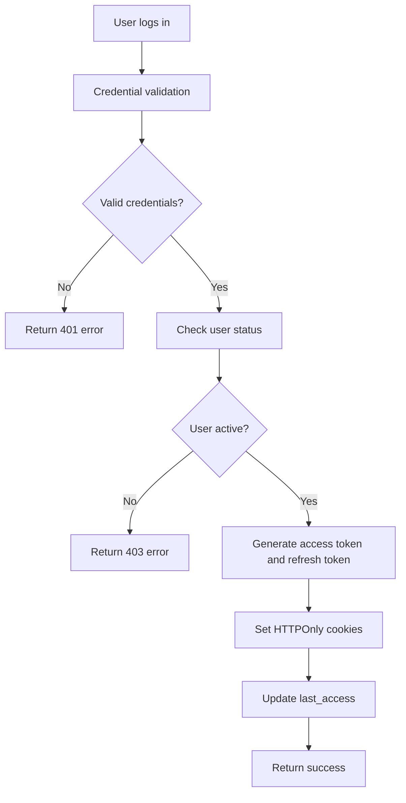
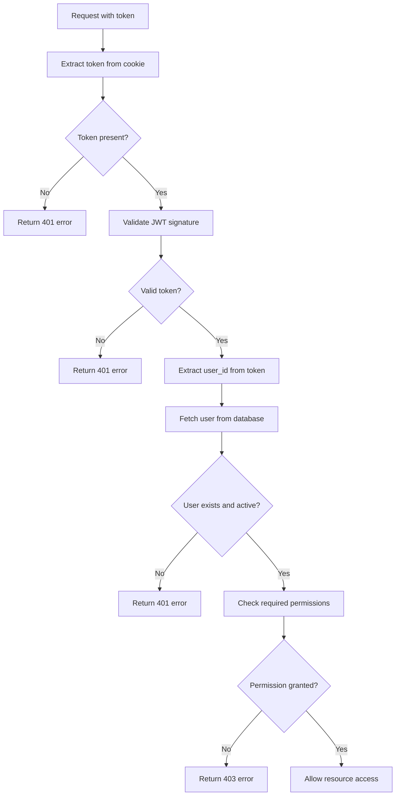

# 🔐 **Synapse RBAC (Role-Based Access Control)**

## 📋 **Executive Summary**

This document defines the Role-Based Access Control (RBAC) model for the Synapse system, specifying permissions, resources, and endpoints for each user type. The system implements a layered security architecture with JWT authentication and granular authorization by functionality.

---

## 🏗️ **Roles and Permissions Matrix**

| Role Name         | Description                                     | Permissions                                                                                                                                                                                                                                                                                        | Assigned Users/Groups | Resource Access                                                                            | Creation Date | Active |
| ----------------- | ----------------------------------------------- | -------------------------------------------------------------------------------------------------------------------------------------------------------------------------------------------------------------------------------------------------------------------------------------------------- | --------------------- | ------------------------------------------------------------------------------------------ | ------------- | ------ |
| **Admin**         | Manages users, permissions and accesses reports | **Users:** CRUD on User Profiles, Update User, Create User, Deactivate User<br>**Reports:** Grant/Remove Report Email Permissions, R on Report History, R on Report Details, Send Reports Manually<br>**AI:** CRUD on AI Agent Interaction<br>**System:** Access to System Logs, Advanced Settings | Administrators        | User Profiles, Report History, Report Details, AI Agent, Administrative Panel, System Logs | 2025/09/29    | ✅     |
| **Regular User**  | Accesses reports and manages own account        | **Reports:** R on Report History, R on Report Details<br>**AI:** CRUD on AI Agent Interaction<br>**Account:** Deactivate Own Account, Reset Own Password, Edit Own Data, Register in System<br>**Chat:** Send/Receive Messages, View Conversation History                                          | Registered Users      | Report History, Report Details, AI Agent, User Profile, Account Settings, Chat Interface   | 2025/09/29    | ✅     |
| **Inactive User** | Deactivated account with no system access       | None                                                                                                                                                                                                                                                                                               | Deactivated Users     | None                                                                                       | 2025/09/29    | ❌     |

---

## 🗺️ **Security Model Overview**

The Synapse RBAC system implements **multi-layered security** with the following components:

### **🔐 Access Control Layers**

1. **Authentication Layer**: JWT-based token validation
2. **Authorization Layer**: Role-based permission checking  
3. **Resource Layer**: Endpoint-specific access control
4. **Data Layer**: User isolation and admin privileges

### **🎯 Permission Mapping Summary**

| Endpoint Category | Public Access | User Access | Admin Access | Notes |
|-------------------|:-------------:|:-----------:|:------------:|-------|
| Authentication    | ✅            | ✅          | ✅           | Login/logout available to all |
| User Registration | ✅            | ❌          | ❌           | Public registration enabled |
| User Profile      | ❌            | ✅          | ✅           | Own profile + admin override |
| Reports (View)    | ❌            | ✅          | ✅           | All authenticated users |
| Reports (Manage)  | ❌            | ❌          | ✅           | Admin-only operations |
| Chat/NLP          | ❌            | ✅          | ✅           | Authenticated user feature |
| Admin Panel       | ❌            | ❌          | ✅           | Strict admin-only access |
| System Endpoints  | ✅            | ✅          | ✅           | Health checks public |

> **📋 For detailed endpoint documentation, see [API Endpoints](./api_endpoints.md)**

---

## 🔒 **Implemented Security Model**

### **🎯 Authentication**

- **JWT (JSON Web Tokens)** with access token and refresh token
- **HTTPOnly Cookies** for secure token storage
- **Configurable expiration** (access: 30min, refresh: 7 days)
- **Automatic token rotation** via `/auth/refresh` endpoint

### **🛡️ Authorization**

- **Role-Based Access Control (RBAC)** with Admin/User roles
- **Validation middleware** (`PermissionValidator`) for administrative endpoints
- **Real-time verification** of user status (is_active)
- **Resource segregation** based on user role

### **🔐 Data Protection**

- **Bcrypt hash** for passwords with automatic salt
- **Input validation** for injection prevention
- **Configured CORS** for secure cross-origin requests
- **Rate limiting** (to implement) for attack prevention

---

## 📋 **Detailed Permissions by Resource**

### **👥 User Management**

| Action                  | Admin | Regular User | Inactive User |
| ----------------------- | ----- | ------------ | ------------- |
| Create user             | ✅    | ❌           | ❌            |
| View all users          | ✅    | ❌           | ❌            |
| View own profile        | ✅    | ✅           | ❌            |
| Edit any user           | ✅    | ❌           | ❌            |
| Edit own profile        | ✅    | ✅           | ❌            |
| Deactivate any user     | ✅    | ❌           | ❌            |
| Deactivate own account  | ✅    | ✅           | ❌            |
| Reset any user password | ✅    | ❌           | ❌            |
| Reset own password      | ✅    | ✅           | ❌            |

### **📊 Reports System**

| Action                   | Admin | Regular User | Inactive User |
| ------------------------ | ----- | ------------ | ------------- |
| View report history      | ✅    | ✅           | ❌            |
| View report details      | ✅    | ✅           | ❌            |
| Send reports manually    | ✅    | ❌           | ❌            |
| Generate new reports     | ✅    | ❌           | ❌            |
| Configure subscribers    | ✅    | ❌           | ❌            |
| Manage email permissions | ✅    | ❌           | ❌            |
| Schedule reports         | ✅    | ❌           | ❌            |

### **🤖 AI Agent Interaction**

| Action                            | Admin | Regular User | Inactive User |
| --------------------------------- | ----- | ------------ | ------------- |
| Access chat interface             | ✅    | ✅           | ❌            |
| Send messages to AI               | ✅    | ✅           | ❌            |
| Receive AI responses              | ✅    | ✅           | ❌            |
| View conversation history         | ✅    | ✅           | ❌            |
| Create new conversations          | ✅    | ✅           | ❌            |
| Delete own conversations          | ✅    | ✅           | ❌            |
| Delete other users' conversations | ✅    | ❌           | ❌            |

### **⚙️ System Administration**

| Action                      | Admin | Regular User | Inactive User |
| --------------------------- | ----- | ------------ | ------------- |
| Access administrative panel | ✅    | ❌           | ❌            |
| View system logs            | ✅    | ❌           | ❌            |
| Configure system            | ✅    | ❌           | ❌            |
| Manage permissions          | ✅    | ❌           | ❌            |
| Monitor performance         | ✅    | ❌           | ❌            |
| Backup and restore          | ✅    | ❌           | ❌            |

---

## 🔄 **Authorization Flows**

### **🔐 Authentication Flow**



### **🛡️ Authorization Flow**



---

## 📊 **Technical Implementation**

### **🔧 Classes and Middlewares**

```python
# Auth Class - Authentication management
class Auth:
    @staticmethod
    def get_current_user() -> CurrentUser
    # Validates token and returns current user

    @staticmethod
    def create_access_token() -> str
    # Generates JWT access token

    @staticmethod
    def create_refresh_token() -> str
    # Generates JWT refresh token

# PermissionValidator Class - Permission validation
class PermissionValidator:
    def __init__(self, user: CurrentUser)
    def execute(self) -> None
    # Validates if user has admin permission
```

### **📋 Security Data Model**

The RBAC system relies on key user attributes for access control:

```python
# Core security attributes from User model
class SecurityContext:
    user_id: int              # Unique user identifier
    is_admin: bool            # Administrative privileges flag
    is_active: bool           # Account status (active/inactive)
    email: str                # User identification
    receive_email: bool       # Email permission flag
```

> **📊 For complete database schema, see [Database Model](./db_model.md)**

---

## 🚨 **Security Considerations**

### **⚠️ Identified Vulnerabilities**

1. **Rate Limiting**: System does not implement login attempt limitation
2. **Session Management**: Lacks active token invalidation on logout
3. **Password Policy**: Minimal password policy (only 8 characters)
4. **Audit Log**: Absence of audit logs for sensitive actions
5. **HTTPS**: Cookies not marked as secure (development)

### **🛡️ Improvement Recommendations**

1. **Implement rate limiting** for authentication endpoints
2. **Add token blacklist** for effective logout
3. **Strengthen password policy** (complexity, expiration)
4. **Implement audit logs** for administrative actions
5. **Configure HTTPS** in production with secure cookies
6. **Add 2FA** for administrative accounts
7. **Implement CSRF protection** for sensitive forms

---

## 📅 **Implementation Roadmap**

### **Phase 1: Basic Features** ✅

- [x] JWT Authentication
- [x] Basic Admin/User Authorization
- [x] User endpoints
- [x] Reports endpoints

### **Phase 2: NLP and Chat** 🔄

- [ ] WebSocket endpoints for chat
- [ ] Conversation system
- [ ] AI integration
- [ ] Message history

### **Phase 3: Advanced Administration** 📋

- [ ] Complete administrative panel
- [ ] Granular user management
- [ ] Audit logs
- [ ] System configurations

### **Phase 4: Advanced Security** 🔒

- [ ] Rate limiting
- [ ] Robust password policy
- [ ] Two-factor authentication
- [ ] Advanced session management

---

## 📖 **References and Standards**

- **OWASP Top 10** - Web application security
- **RFC 7519** - JSON Web Token (JWT)
- **NIST 800-63B** - Digital Identity Guidelines
- **ISO 27001** - Information Security Management

---

**📝 Last Updated:** 29/09/2025  
**👤 Responsible:** Synapse Development Team  
**🔄 Next Review:** Sprint 3 Start  
**📊 Status:** Partial Implementation (40% complete)
